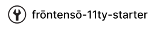

# WebGL/GSAP/D3 Tech Demo

This is a tech demo for a WebGL/GSAP/D3 project. It is based on the [frontenso-11ty-starter](https://github.com/einomi/frontenso-11ty-starter) template.

The glTF model was created in Blender.

Figma was used for the design – https://www.figma.com/file/7lVwDFgkkB5gMZwWctBl64/Molecule-Tech-Demo?type=design&node-id=0%3A1&mode=design&t=fQWRRTdxhmpRrAtF-1

(c) Andrew Nikonov, 2023

# Demo Page

## https://webgl-molecule-demo-einomi.netlify.app/

# frontenso-11ty-starter Documentation

Refer to [this guide](https://github.com/einomi/frontenso-11ty-starter) for information on how to use the 11ty boilerplate.
